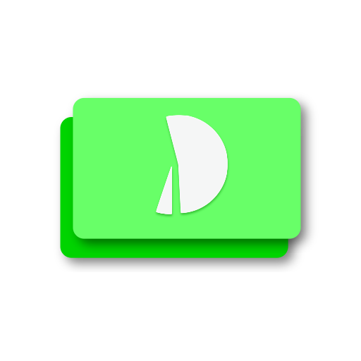

<p align="center">
  
</p>

# deal

Readable text-based slides based on [pug](https://github.com/pugjs/pug) syntax with [MathJax](https://www.mathjax.org) support which handles the formatting for you.

Example:
```pug
p-slide.title
    h1#yay Welcome to deal
    h3 A beautiful slide renderer written in Pug/CSS/JS

    animation-list
        li.withPrevious.fadeIn(target="#yay")
        li.afterPrevious.bounceIn(target="h3")
        li.onClick.shake(target="h3")
        li.onClick.bounceOut(target="h3")
        li.fromPrevious.bounceOut(target="h1" delay="0.5")
```

Click [here](https://parangspace--lyc.repl.co) for live demo. (OUTDATED)

Features:
* Built-in theme selection
* Slide aspect ratio configuration
* Slide controls using mouse/keyboard
    * previous operation: left, up, click back
    * next operation: right, down, space, enter, click next
* Fullscreen mode
* Automatic font size scaling to fit slides
* Text-based animations with [animate.css](https://github.com/daneden/animate.css) with support for:
    * triggers: `onClick`, `withPrevious`, `afterPrevious` and `fromPrevious`
* Pug-based syntax for writing slides
* Run as a single binary

## Getting Started

These instructions will get you a copy of the project up and running on your local machine for development and testing purposes. See usage for notes on using the project.

### Prerequisites

You will need to have the following
* node.js
* npm
* nodemon (for testing)
* ~~[pkg](https://github.com/zeit/pkg) (for building binaries)~~ (will crash with node v12.0, see this [issue](https://github.com/zeit/pkg/issues/681))
* [nexe](https://github.com/nexe/nexe) (for building binaries)

### Installation

Clone this repository

```shell
git clone https://github.com/l-yc/pug-slides
```

Install the dependencies

```shell
cd pug-slides
npm install
```

Start the app

```shell
npm start
```

To watch for edits
```shell
npm test
```

To rebuild binaries

```shell
rm -r node_modules && npm install --only=production     # optional, slow and only removes ~1 MB of dependencies
npm run clean
npm run build
```

To create custom builds, modify the `buildTargets` variable in `build.js`.

Note: a rough estimate of the size of the binary is given by the size of `node_modules` + 13.4 MB (node). To analyse the size of `node_modules`:
```bash
du ./node_modules --max-depth=1 -h | sort -h
```
Current distribution size is ~80 MB, target size is ~50 MB or less.

## Usage

### Running the app

Pre-built binaries made with [nexe](https://github.com/nexe/nexe) are available in `builds/` for MacOS, Windows and Linux. Running the binary in a certain directory will set that as the home directory for the file browser.

### Slide Controls

You can go to previous/next operation using the button above the slide.
Alternatively, you may also use arrow keys as well as the space and enter keys for navigating.

Clicking on the expand button enables fullscreen mode.

### Writing

To create a new presentation, create a new `.pug` file in `tests/`. An minimal example is shown below.

```pug
head
    slide-settings(name="sample-slide" aspectRatio="4:3" theme="default")

    slide-transitions(
        exit="fadeOutLeft"
        entrance="fadeInRight"
        durationEach="0.5s"
    )

body
    p-slide.layout-title(exit="zoomOutUp" entrance="zoomInDown" durationEach="0.5s")
        h1#title Welcome to deal
        h3 A beautiful slide renderer written in Pug/CSS/JS

        animation-list
            li.withPrevious.fadeIn(target="#title")
            li.afterPrevious.bounceIn(target="h3")
            li.onClick.shake(target="h3")
            li.onClick.bounceOut(target="h3")
            li.fromPrevious.bounceOut(target="h1" delay="0.5")

    p-slide
        h1 How to use PugSlides?
        .row
            .column(style="flex:1")
                p With deal, you can code slides in #[a(href="https://pugjs.org/api/getting-started.html") pug]
                p You can configure settings in #[strong head]
            .column(style="flex:1")
                p Or even themes by creating your own stylesheets
                p If you are a coder, you can add javascript to your slides too
        animation-list
            li.onClick.fadeIn(target=".column:nth-child(1) p:nth-child(1)")
            li.onClick.fadeIn(target=".column:nth-child(1) p:nth-child(2)")
            li.onClick.fadeIn(target=".column:nth-child(2) p:nth-child(1)")
            li.onClick.fadeIn(target=".column:nth-child(2) p:nth-child(2)")
```

A presentation file is split into 2 parts, the head and the body. Under the head tag, you can include the various slide settings and global options.

Slide settings include:
* name: Name of presentation (default: "(Unspecified)")
* aspectRatio: Ratio of width to height of slide (default: "4:3")
* theme: Theme to use for the presentation (default: "default")

Under the body tag, you can write your slides. Each slides should be nested under a `p-slide` tag, which can be assigned classes to specify its layout. Within the `p-slide` tag, any standard html elements can be used.  You may also organise your content into rows and columns using the provided `.row` and `.column` classes and specify their ratios using like so

```pug
// 1:2 ratio
.row
    .column(style="flex:0.5")
    .column(style="flex:1")
```

To utilise the automatic text scaling feature, you must specify font sizes in the unit `em`, e.g. `1em`. Reasonable ranges are usually in the range ~`1em` to `2em`, but feel free to play around with the value to modify the ratio of font sizes. Below is an example of modifying the font size of a `p` element:

```pug
p(style="font-size: 1.5em")
```

### Including assets
All paths are expanded relative to the directory of the source pug file, e.g. if `presentation.pug` is in `$HOME` and includes the following image:

```pug
figure(style="height: 30em")
    img(src="./images/picture.jpg")
    figcaption A picture
```

Then the `deal` server will search for the file in `$HOME/images`.

Dimensions of the image should never be specified directly for auto scaling to work; always wrap an image in a `figure` tag and **style the figure**

### Slide Transitions

You can specify slide transitions for the entire presentation (global) or for specific slides (local). Local transitions override global transitions. An example of global transitions is as follows (add this in `head`):

```pug
slide-transitions(
    exit="fadeOutLeft"
    entrance="fadeInRight"
    durationEach="0.5s"
)
```

An example of local transition:
```pug
p-slide(exit="zoomOutUp" entrance="zoomInDown" durationEach="0.5s")
```

The options are described below:
* `exit`: The name of the animation to use for the exiting slide
* `entrance`: The name of the animation to use for the entering slide
* `durationEach`: The duration of each animation, i.e. **half the total slide transition duration**

### Animations

To include animations, you can add them under the `animation-list` tag for a slide.

Each animation item will have the following syntax:
```pug
li.<trigger>.<name>(target="<selector>" <any additional options in key-value format>)
```
or
```pug
li(class="<trigger> <name>" target="<selector>" <any additional options in key-value format>)
```

The order of trigger, name and parentheses enclosed options are interchangeable.

Available triggers are listed below:
* `onClick`: triggered on click
* `withPrevious`: triggered at the start of the previous animation
* `afterPrevious`: triggered upon completion of previous animation
* `fromPrevious`: triggered `delay` seconds after the start of the previous animation. `delay` needs to be specified within the parentheses.

Selectors follow standard css selectors. If multiple elements match the given selector, the earliest occurring one will receive the animation.

In summary, all the available options in the enclosed brackets are listed below:
* `target`: css selector for animation target
* `delay` (only for fromPrevious): seconds to wait from the previous animation, e.g. `'0.2s'`, `'1s'`
* `duration` (default: `'1s'`): length of the animation, speed will scale accordingly

Comments can be added within your slides if necessary by adding `//` , which will cause everything afterwards to be invisible in the generated slides (though **they are still visible in the generated code**)

## Contributing

Pull requests are welcome. For major changes, please open an issue first to discuss what you would like to change.

## License

[MIT](https://choosealicense.com/licenses/mit/)
